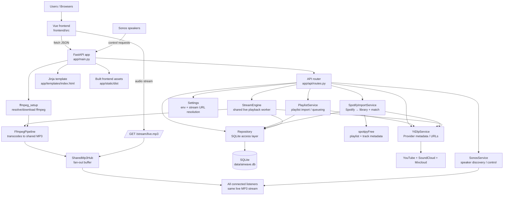

# Airwave

A WSL-friendly FastAPI application that exposes one shared live MP3 stream for all connected clients. Users can queue supported provider URLs into a shared queue (YouTube, SoundCloud, and Mixcloud single shows). **Spotify playlists** can be **imported into the library** (not queued directly): track titles are read without the Spotify Web API, then each track is matched against YouTube, SoundCloud, and Mixcloud search in parallel and stored like other saved playlists.

## Quick Start

1. Install Python 3.10+ and SQLite support.
2. Install dependencies:
   - `python3 -m venv .venv`
   - `source .venv/bin/activate`
   - `python -m pip install --upgrade pip setuptools wheel`
   - `python -m pip install ".[dev]"`
3. Install frontend dependencies and build local Vue assets:
   - `npm install`
   - `npm run build`
4. Install `yt-dlp` binary:
   - `./scripts/setup_yt_dlp.sh`
5. Install `deno` (JS runtime for yt-dlp provider extraction support):
   - `./scripts/setup_deno.sh`
6. (Optional) install `ffmpeg` manually:
   - `./scripts/setup_ffmpeg.sh`
7. Start the app:
   - `./scripts/run_dev.sh`

Open `http://127.0.0.1:8000`.

## Supported Providers

- YouTube: single videos and playlists.
- SoundCloud: single tracks and `/sets/` playlists.
- Mixcloud: single shows only.
- **Spotify:** **playlist URLs only** (`https://open.spotify.com/playlist/...`). Import adds a normal library playlist; playback uses the matched provider URLs (see below).

## Spotify playlist import

Spotify support is **import-only**. Pasting a Spotify **playlist** link in the top bar shows **Import playlist** (no play/queue actions for that URL). After import you are taken to a **review page** (`/spotify-import/<playlist id>`) that lists tracks on the left and provider search results on the right. Searches for YouTube, SoundCloud, and Mixcloud run **in parallel** per track; the first hit in provider order (YouTube, then SoundCloud, then Mixcloud) is selected by default, and you can pick another result before continuing.

Implementation notes:

- Playlist metadata and track lists come from **[spotipyFree](https://github.com/TzurSoffer/spotipyFree)** (PyPI: `spotipyFree`), a Spotipy-like client that does **not** use the Spotify Web API or require a Spotify login. It may break if Spotify changes their site.
- Matched entries are stored in the same **`playlists` / `playlist_entries`** tables as other imports; unresolved rows use an internal pending URL until a provider match is saved.
- The generic **`POST /api/playlist/import`** endpoint rejects raw Spotify playlist URLs; use **`POST /api/spotify/import`** (see `app/api/routes.py`).

## Docker

The included `docker-compose.yml` uses `network_mode: host` on Linux so Sonos discovery can receive the SSDP multicast traffic that Sonos speakers use on the LAN. The default Docker bridge network is often enough for the web UI, but not for Sonos discovery.

When running in Docker for Sonos playback, also set `AIRWAVE_PUBLIC_BASE_URL` to a LAN-reachable URL such as `http://192.168.1.50:8000` so speakers can fetch the shared stream.

## Environment Variables

The app reads `AIRWAVE_*` variables from the environment or a local `.env` file. Example:

```env
AIRWAVE_HOST=0.0.0.0
AIRWAVE_PORT=8000
AIRWAVE_PUBLIC_BASE_URL=http://192.168.1.50:8000
AIRWAVE_FFMPEG_PATH=./bin/ffmpeg
AIRWAVE_YT_DLP_PATH=./bin/yt-dlp
AIRWAVE_DENO_PATH=./bin/deno
AIRWAVE_LOG_LEVEL=info 
```

For log level, valid values are:
debug, info, warning, error

### App Settings

| Variable | Default | Purpose |
| --- | --- | --- |
| `AIRWAVE_APP_NAME` | `Airwave` | Display name used by the FastAPI app and UI template. |
| `AIRWAVE_DB_URL` | `sqlite+pysqlite:///./data/airwave.db` | SQLAlchemy database URL. |
| `AIRWAVE_HOST` | `0.0.0.0` | Host used by `scripts/run_dev.sh` when starting `uvicorn`. |
| `AIRWAVE_PORT` | `8000` | Port used by `scripts/run_dev.sh` and as the fallback port for stream URL generation. |
| `AIRWAVE_PUBLIC_BASE_URL` | `http://127.0.0.1:8000` | Base URL used to build the public stream URL exposed to browsers and Sonos devices. |
| `AIRWAVE_STREAM_PATH` | `/stream/live.mp3` | Path appended to the public base URL for the shared MP3 stream endpoint. |
| `AIRWAVE_YT_DLP_PATH` | `./bin/yt-dlp` | Path to the `yt-dlp` binary used for provider metadata extraction, URL resolution, and search. Also used by `scripts/setup_yt_dlp.sh` as its install target. |
| `AIRWAVE_FFMPEG_PATH` | `ffmpeg` | Path or executable name for `ffmpeg`. Also used by `scripts/setup_ffmpeg.sh` as its install target. |
| `AIRWAVE_DENO_PATH` | `./bin/deno` | Path to the `deno` binary (JS runtime used by yt-dlp extractors). Also used by `scripts/setup_deno.sh` as its install target. |
| `AIRWAVE_MP3_BITRATE` | `128k` | MP3 bitrate passed into the ffmpeg transcoding pipeline. |
| `AIRWAVE_CHUNK_SIZE` | `2048` | Stream chunk size used when the shared MP3 output is read and distributed to listeners. |
| `AIRWAVE_QUEUE_POLL_SECONDS` | `1.0` | How often the stream engine checks for queued items when idle. |
| `AIRWAVE_STREAM_STATS_LOG_SECONDS` | `15.0` | Interval for periodic stream-engine runtime stats logging. |
| `AIRWAVE_HISTORY_LIMIT` | `50` | Maximum number of playback history rows returned by `/history`. |

### Notes

1. `AIRWAVE_PUBLIC_BASE_URL` is the variable used to build the public stream URL for browsers and Sonos; set it to your host or IP (e.g. `http://192.168.1.50:8000`) when clients outside the local browser need to reach the stream.
2. If `AIRWAVE_PUBLIC_BASE_URL` points at `localhost`, `0.0.0.0`, `host.docker.internal`, or a loopback IP, the app tries to detect a LAN IP automatically. Domain names (e.g. `airwave.local.example.com`) are used as-is.
3. `AIRWAVE_FFMPEG_PATH` can be either a binary name on `PATH` or an explicit file path such as `./bin/ffmpeg`.
4. `AIRWAVE_YT_DLP_PATH`, `AIRWAVE_FFMPEG_PATH`, and `AIRWAVE_DENO_PATH` are used both by the app and by the install helper scripts.

## Running Tests

1. Activate your virtual environment:
   - `source .venv/bin/activate`
2. Install dev dependencies if you have not already:
   - `python -m pip install ".[dev]"`
3. Run the test suite:
   - `python -m pytest`
   - Tests default to a 300-second timeout per test.

If `ffmpeg` is missing, the app will try to auto-download a Linux binary from GitHub to `./bin/ffmpeg` at startup.

If the app is running in Docker or otherwise resolves to a non-routable local address for Sonos clients, set `AIRWAVE_PUBLIC_BASE_URL` to the full base URL (e.g. `http://192.168.1.50:8000`) you want the shared stream URL to use. On Linux Docker hosts, Sonos discovery also requires host networking because the default bridge network does not reliably expose SSDP multicast traffic to the container.


## App Structure

### Runtime Architecture



### Directory Map

```text
airwave/   (repo root; formerly mytube)
├── app/
│   ├── main.py                    # FastAPI app factory; wires services into app state
│   ├── api/
│   │   └── routes.py              # HTTP routes for queue, playlists, stream, state, Sonos
│   ├── core/
│   │   ├── config.py              # Environment-backed settings and public stream URL logic
│   │   └── logging.py             # Logging configuration
│   ├── db/
│   │   ├── models.py              # SQLAlchemy models: queue, history, playlists, settings
│   │   └── repository.py          # Persistence layer used by routes and services
│   ├── services/
│   │   ├── stream_engine.py       # Background playback loop + shared MP3 publish/subscribe hub
│   │   ├── ffmpeg_pipeline.py     # Launches ffmpeg to convert source media into MP3 chunks
│   │   ├── ffmpeg_setup.py        # Ensures ffmpeg is available, including fallback install path
│   │   ├── yt_dlp_service.py      # Provider-agnostic extractor orchestration and search
│   │   ├── yt_dlp_client.py       # Raw yt-dlp subprocess client
│   │   ├── playlist_service.py    # Playlist preview/import and queue construction helpers
│   │   ├── spotify_free_service.py   # Spotify URL parsing + playlist fetch via spotipyFree
│   │   ├── spotify_import_service.py # Spotify import session, parallel match, API state
│   │   ├── extractors/            # Provider normalizers (YouTube/SoundCloud/Mixcloud)
│   │   └── sonos_service.py       # Sonos discovery, grouping, playback, volume control
│   ├── templates/
│   │   └── index.html             # Server-rendered HTML shell
│   └── static/
│       ├── dist/                  # Built Vue assets served by FastAPI
│       ├── css/                   # Legacy/static styles
│       └── js/                    # Legacy/static scripts
├── frontend/
│   ├── src/
│   │   ├── App.vue                # Root Vue component
│   │   ├── components/            # Queue, history, player, Sonos, top bar, sidebar panels
│   │   ├── composables/
│   │   │   └── useApi.js          # Thin fetch wrapper used by Vue components
│   │   ├── main.js                # Vue bootstrap
│   │   ├── router.js              # Frontend router
│   │   └── style.css              # Global frontend styles
│   └── index.html                 # Vite entry for frontend build
├── scripts/
│   ├── run_dev.sh                 # Dev launcher: activates venv, builds frontend if needed, starts uvicorn
│   ├── setup_ffmpeg.sh            # Optional ffmpeg installation helper
│   └── setup_yt_dlp.sh            # yt-dlp installation helper
├── tests/                         # Python unit/integration coverage for API, services, config, DB
├── tests_e2e/                     # Browser smoke test(s)
├── bin/                           # Local tool binaries such as ffmpeg and yt-dlp
├── data/                          # Persistent data (default SQLite database location)
├── pyproject.toml                 # Python package and tool configuration
├── package.json                   # Frontend build dependencies and scripts
└── README.md
```

### How The Pieces Fit Together

1. `uvicorn app.main:create_app --factory` starts the FastAPI app and builds shared singletons for the repository, stream engine, playlist service, Sonos service, yt-dlp service, and ffmpeg pipeline.
2. The Vue frontend calls JSON endpoints in `app/api/routes.py` for queue management, playlist browsing/import, Spotify import flow, player state, provider-aware search, and Sonos control.
3. `PlaylistService` turns a pasted supported URL into either one queue item or many playlist-backed queue items, storing metadata in SQLite through `Repository`. Spotify playlist URLs use `SpotifyImportService` and dedicated `/api/spotify/*` routes instead.
4. `StreamEngine` runs in the background, polls the queue, resolves metadata with `YtDlpService`, streams source audio bytes from `yt-dlp`, pipes them through `FfmpegPipeline`, and publishes MP3 chunks to every connected listener.
5. `/stream/live.mp3` does not create a separate stream per client; each subscriber receives the same shared live MP3 feed from `SharedMp3Hub`.
6. Sonos endpoints use the same shared stream URL, so browser clients and Sonos speakers consume the same live output.
