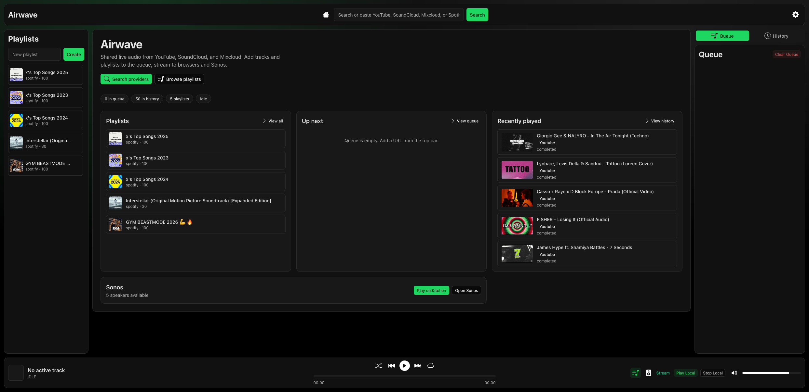
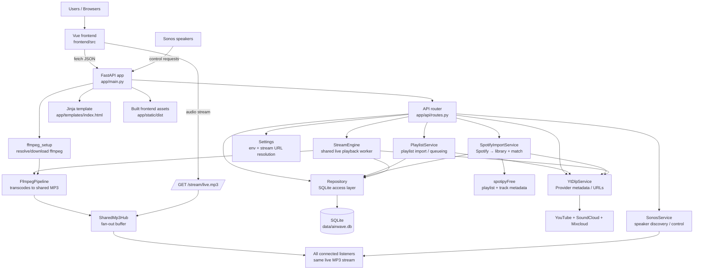

# Airwave 👋


[](https://vuejs.org/)

**Airwave is a self-hosted, WSL-friendly radio stack: one shared live MP3 stream for every listener.** Paste **YouTube**, **SoundCloud**, or **Mixcloud** URLs into a **shared queue**; browsers and **Sonos** speakers all subscribe to the **same** stream URL. **Spotify playlists** import into your **library** (not the live queue): tracks are resolved against YouTube, SoundCloud, and Mixcloud in parallel, then you review matches before saving.

Built with **FastAPI**, **Vue 3**, **yt-dlp**, **ffmpeg**, and **SQLite**



> [!TIP]
> **Running in Docker with Sonos?** Use `network_mode: host` on Linux so SSDP discovery works, and set `AIRWAVE_PUBLIC_BASE_URL` to a **LAN-reachable** base URL (for example `http://192.168.1.50:8000`) so speakers can open the shared stream.

---

## Key Features of Airwave ⭐

- 🔊 **One shared live stream**: Every client hears the same `/stream/live.mp3` feed from a single playback worker—no per-browser transcoding or duplicate encodes.

- 📋 **Collaborative queue**: Add tracks from the web UI; the stream engine walks the queue, resolves sources, and fans MP3 chunks out to all subscribers.

- ▶️ **YouTube**: Queue single videos or full playlists; metadata and URLs flow through **yt-dlp** (with optional **deno** for extractor support).

- 🎧 **SoundCloud**: Single tracks and `/sets/` playlists import and queue like other library sources.

- ☁️ **Mixcloud**: Single shows are supported end-to-end for queueing and playback.
laylist_entries` model as other imports. Use **`POST /api/spotify/import`** (the generic playlist import endpoint rejects raw Spotify playlist URLs).

- 🔈 **Sonos integration**: Discover speakers on the LAN, group them, control volume, and point them at the **same** public stream URL as the browser. Requires reachable `AIRWAVE_PUBLIC_BASE_URL` from the speaker network.

- 🖥️ **Modern web UI**: **Vue 3**, **Vite**, file-based routes (`frontend/src/pages/`), and **@nuxt/ui** with theme switching persisted in local storage. On desktop, **Queue vs Sonos** in the right column and the **Queue / History** tab choice are also remembered (see `frontend/src/css/themes/` and [General settings](./frontend/src/pages/settings/index.vue)).

- 🔍 **Smart top bar**: One field for **provider search** or **pasted URLs**. For URLs, actions depend on context: **Play** / **Queue**, **Play playlist** / **Queue playlist**, **Import playlist** into the library, and handling for YouTube links with `list=` / `start_radio` (including **canonical playlist** normalization). Optional dropdown to **target a specific playlist** when importing or adding. On small screens, a sheet captures the same flow.

- 🔎 **Provider search page** (`/search`): Results from the unified query with **per-provider filters** (counts per YouTube, SoundCloud, Mixcloud, or all). Each hit supports **Play now**, **Add to queue**, and **Add to playlist** (with searchable playlist picker).

- 📋 **Queue & history**: **Drag-and-drop** reorder for queued items (touch-friendly delay), **Clear queue**, and a **History** tab with **Clear history**. Track rows expose the same actions as search; **Live** streams show a badge when the backend marks them live.

- 🎮 **Player bar & fullscreen**: **Shuffle**, **previous / next**, **repeat** (off → all → one), and a **seekable progress** bar when the current item allows seeking. Tap the strip (or mobile mini-bar) to open a **fullscreen now-playing** view with art and controls. **Play Local** / **Stop Local** plays the shared stream in the browser via `<audio>`, with **volume** and **mute**. **Media Session** (where supported) syncs title, artwork, play/pause, skip, and position for OS and lock-screen controls.

- 📚 **Playlists & library**: **Create** playlists inline, **pin** and **drag** to reorder (pinned and unpinned sections), **edit** title/description, **delete**, and open a **detail page** with cover art, duration totals, **Play now** / **Queue**, **merge all tracks into another playlist** (with duplicate detection: **Add all** vs **Add new ones**), and **reorder entries**. **Remote YouTube** account playlists appear in the sidebar with **Import playlist** to pull them into the local library.

- 🎵 **Spotify import UI**: Two-pane **review** experience—track list on the left, **YouTube / SoundCloud / Mixcloud** candidate matches on the right; pick a winner per track.

- 💾 **SQLite by default**: Queue, history, playlists, and settings persist through SQLAlchemy; override with `AIRWAVE_DB_URL` for other SQLAlchemy URLs.

- ⚙️ **Environment-driven config**: Stream URL, bitrate, tool paths (`yt-dlp`, `ffmpeg`, `deno`), logging, and history limits are controlled with **`AIRWAVE_*`** variables (see below).

- 🐳 **Docker-friendly**: `docker-compose` patterns documented for host networking when Sonos discovery matters.

---

## How to Install 🚀

### Local development

1. Install **Python 3.10+** and ensure SQLite is available.
2. Create a virtualenv and install the app (dev extras recommended):

   ```bash
   python3 -m venv .venv
   source .venv/bin/activate
   python -m pip install --upgrade pip setuptools wheel
   python -m pip install ".[dev]"
   ```

3. Install and build the **Vue** frontend:

   ```bash
   npm install
   npm run build
   ```

4. Install **yt-dlp**:

   ```bash
   ./scripts/setup_yt_dlp.sh
   ```

5. Install **deno** (used by yt-dlp for some extractors):

   ```bash
   ./scripts/setup_deno.sh
   ```

6. *(Optional)* Install **ffmpeg** (or let the app try a Linux fallback at startup):

   ```bash
   ./scripts/setup_ffmpeg.sh
   ```

7. Start the server:

   ```bash
   ./scripts/run_dev.sh
   ```

Open [http://127.0.0.1:8000](http://127.0.0.1:8000).

> [!NOTE]
> If `ffmpeg` is missing on Linux, the app may auto-download a binary into `./bin/ffmpeg` at startup. For predictable production behavior, install ffmpeg explicitly.

---

## Supported providers

| Provider    | Queue / playback              | Playlists                         |
| ----------- | ----------------------------- | --------------------------------- |
| YouTube     | Single videos                 | Playlists                         |
| SoundCloud  | Single tracks                 | `/sets/` playlists                |
| Mixcloud    | Single shows                  | —                                 |
| Spotify     | Via matched URLs after import | **Playlist URLs → library import only** |

---

## Docker 🐳

The included `docker-compose.yml` uses `network_mode: host` on Linux so Sonos discovery can receive the SSDP multicast traffic that Sonos speakers use on the LAN. The default Docker bridge network is often enough for the web UI, but not for Sonos discovery.

When running in Docker for Sonos playback, set `AIRWAVE_PUBLIC_BASE_URL` to a LAN-reachable URL such as `http://192.168.1.50:8000` so speakers can fetch the shared stream.

---

## Environment variables

The app reads `AIRWAVE_*` variables from the environment or a local `.env` file.

### Example

```env
AIRWAVE_HOST=0.0.0.0
AIRWAVE_PORT=8000
AIRWAVE_PUBLIC_BASE_URL=http://192.168.1.50:8000
AIRWAVE_FFMPEG_PATH=./bin/ffmpeg
AIRWAVE_YT_DLP_PATH=./bin/yt-dlp
AIRWAVE_DENO_PATH=./bin/deno
AIRWAVE_LOG_LEVEL=info
```

Valid log levels: `debug`, `info`, `warning`, `error`.

### App settings

| Variable | Default | Purpose |
| --- | --- | --- |
| `AIRWAVE_APP_NAME` | `Airwave` | Display name used by the FastAPI app and UI template. |
| `AIRWAVE_DB_URL` | `sqlite+pysqlite:///./data/airwave.db` | SQLAlchemy database URL. |
| `AIRWAVE_HOST` | `0.0.0.0` | Host used by `scripts/run_dev.sh` when starting `uvicorn`. |
| `AIRWAVE_PORT` | `8000` | Port used by `scripts/run_dev.sh` and as the fallback port for stream URL generation. |
| `AIRWAVE_PUBLIC_BASE_URL` | `http://127.0.0.1:8000` | Base URL used to build the public stream URL exposed to browsers and Sonos devices. |
| `AIRWAVE_STREAM_PATH` | `/stream/live.mp3` | Path appended to the public base URL for the shared MP3 stream endpoint. |
| `AIRWAVE_YT_DLP_PATH` | `./bin/yt-dlp` | Path to the `yt-dlp` binary used for provider metadata extraction, URL resolution, and search. Also used by `scripts/setup_yt_dlp.sh` as its install target. |
| `AIRWAVE_FFMPEG_PATH` | `ffmpeg` | Path or executable name for `ffmpeg`. Also used by `scripts/setup_ffmpeg.sh` as its install target. |
| `AIRWAVE_DENO_PATH` | `./bin/deno` | Path to the `deno` binary (JS runtime used by yt-dlp extractors). Also used by `scripts/setup_deno.sh` as its install target. |
| `AIRWAVE_MP3_BITRATE` | `128k` | MP3 bitrate passed into the ffmpeg transcoding pipeline. |
| `AIRWAVE_CHUNK_SIZE` | `2048` | Stream chunk size used when the shared MP3 output is read and distributed to listeners. |
| `AIRWAVE_QUEUE_POLL_SECONDS` | `1.0` | How often the stream engine checks for queued items when idle. |
| `AIRWAVE_STREAM_STATS_LOG_SECONDS` | `15.0` | Interval for periodic stream-engine runtime stats logging. |
| `AIRWAVE_HISTORY_LIMIT` | `50` | Maximum number of playback history rows returned by `/history`. |

### Notes

1. `AIRWAVE_PUBLIC_BASE_URL` builds the public stream URL for browsers and Sonos; set it to your host or IP (e.g. `http://192.168.1.50:8000`) when clients outside the local browser need to reach the stream.
2. If `AIRWAVE_PUBLIC_BASE_URL` points at `localhost`, `0.0.0.0`, `host.docker.internal`, or a loopback IP, the app tries to detect a LAN IP automatically. Domain names (e.g. `airwave.local.example.com`) are used as-is.
3. `AIRWAVE_FFMPEG_PATH` can be either a binary name on `PATH` or an explicit file path such as `./bin/ffmpeg`.
4. `AIRWAVE_YT_DLP_PATH`, `AIRWAVE_FFMPEG_PATH`, and `AIRWAVE_DENO_PATH` are used both by the app and by the install helper scripts.

---

## Running tests

1. Activate your virtual environment: `source .venv/bin/activate`
2. Install dev dependencies if needed: `python -m pip install ".[dev]"`
3. Run: `python -m pytest`  
   Tests default to a **300-second** timeout per test.

---

## App structure

### Runtime architecture



### Directory map

```text
airwave/   (repo root; formerly mytube)
├── app/
│   ├── main.py                    # FastAPI app factory; wires services into app state
│   ├── api/
│   │   └── routes.py              # HTTP routes for queue, playlists, stream, state, Sonos
│   ├── core/
│   │   ├── config.py              # Environment-backed settings and public stream URL logic
│   │   └── logging.py             # Logging configuration
│   ├── db/
│   │   ├── models.py              # SQLAlchemy models: queue, history, playlists, settings
│   │   └── repository.py          # Persistence layer used by routes and services
│   ├── services/
│   │   ├── stream_engine.py       # Background playback loop + shared MP3 publish/subscribe hub
│   │   ├── ffmpeg_pipeline.py     # Launches ffmpeg to convert source media into MP3 chunks
│   │   ├── ffmpeg_setup.py        # Ensures ffmpeg is available, including fallback install path
│   │   ├── yt_dlp_service.py      # Provider-agnostic extractor orchestration and search
│   │   ├── yt_dlp_client.py       # Raw yt-dlp subprocess client
│   │   ├── playlist_service.py    # Playlist preview/import and queue construction helpers
│   │   ├── spotify_free_service.py   # Spotify URL parsing + playlist fetch via spotipyFree
│   │   ├── spotify_import_service.py # Spotify import session, parallel match, API state
│   │   ├── extractors/            # Provider normalizers (YouTube/SoundCloud/Mixcloud)
│   │   └── sonos_service.py       # Sonos discovery, grouping, playback, volume control
│   ├── templates/
│   │   └── index.html             # Server-rendered HTML shell
│   └── static/
│       ├── dist/                  # Built Vue assets served by FastAPI
│       ├── css/                   # Legacy/static styles
│       └── js/                    # Legacy/static scripts
├── frontend/
│   ├── src/
│   │   ├── App.vue                # Root Vue component
│   │   ├── components/            # Queue, history, player, Sonos, top bar, sidebar panels
│   │   ├── composables/
│   │   │   └── useApi.js          # Thin fetch wrapper used by Vue components
│   │   ├── main.js                # Vue bootstrap
│   │   ├── router.js              # Frontend router
│   │   └── style.css              # Global frontend styles
│   └── index.html                 # Vite entry for frontend build
├── scripts/
│   ├── run_dev.sh                 # Dev launcher: activates venv, builds frontend if needed, starts uvicorn
│   ├── setup_ffmpeg.sh            # Optional ffmpeg installation helper
│   └── setup_yt_dlp.sh            # yt-dlp installation helper
├── tests/                         # Python unit/integration coverage for API, services, config, DB
├── tests_e2e/                     # Browser smoke test(s)
├── bin/                           # Local tool binaries such as ffmpeg and yt-dlp
├── data/                          # Persistent data (default SQLite database location)
├── pyproject.toml                 # Python package and tool configuration
├── package.json                   # Frontend build dependencies and scripts
└── README.md
```

### How the pieces fit together

1. `uvicorn app.main:create_app --factory` starts the FastAPI app and builds shared singletons for the repository, stream engine, playlist service, Sonos service, yt-dlp service, and ffmpeg pipeline.
2. The Vue frontend calls JSON endpoints in `app/api/routes.py` for queue management, playlist browsing/import, Spotify import flow, player state, provider-aware search, and Sonos control.
3. `PlaylistService` turns a pasted supported URL into either one queue item or many playlist-backed queue items, storing metadata in SQLite through `Repository`. Spotify playlist URLs use `SpotifyImportService` and dedicated `/api/spotify/*` routes instead.
4. `StreamEngine` runs in the background, polls the queue, resolves metadata with `YtDlpService`, streams source audio bytes from `yt-dlp`, pipes them through `FfmpegPipeline`, and publishes MP3 chunks to every connected listener.
5. `/stream/live.mp3` does not create a separate stream per client; each subscriber receives the same shared live MP3 feed from `SharedMp3Hub`.
6. Sonos endpoints use the same shared stream URL, so browser clients and Sonos speakers consume the same live output.

---

## Support 💬

Questions and ideas: open an issue or see [CONTRIBUTING.md](./CONTRIBUTING.md) (including [Discussions](https://github.com/76696265636f646572/Airwave/discussions)).
